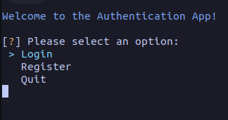
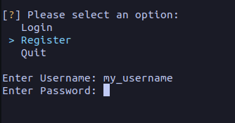
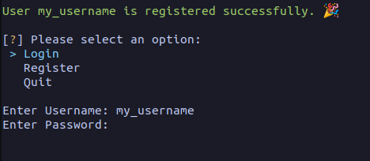
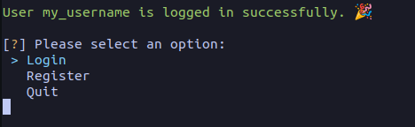
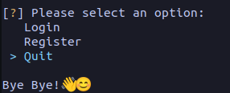

## Overview
This project is an authentication Command Line Interface (CLI) application built using SQLAlchemy to abstract the database operations and PostgreSQL as the underlying database management system. It utilizes Alembic for database migration management and follows the Model-View-Controller (MVC) architectural pattern for structuring the codebase.

## Installation Guide

### Prerequisites
Ensure that PostgreSQL is installed on your system before proceeding with the installation.

### Installation Steps
1. Clone the repository:
   ```bash
   git clone https://github.com/AliHezarpisheh/auth-sqlalchemy.git
   ```

2. Navigate to the project directory:
   ```bash
   cd auth-sqlalchemy
   ```

3. Install dependencies using Poetry:
   ```bash
   poetry install
   ```
   This will create a virtual environment and install all required dependencies defined in the `pyproject.toml` file.

4. Activate the virtual environment:
   ```bash
   source .venv/bin/activate (On Linux) OR source .venv/Scripts/activate (On Windows)
   ```

5. Set up the PostgreSQL database:
   - Create a PostgreSQL database named `auth_db_sample_project`.

6. Run database migrations using Alembic:
   ```bash
   alembic upgrade head
   ```
   This will create the necessary database tables based on the defined models.

7. You're all set! You can now run the application.

### Alternative Installation with pip
If you prefer using pip instead of Poetry, follow these steps:

1. Clone the repository:
   ```bash
   git clone https://github.com/AliHezarpisheh/auth-sqlalchemy.git
   ```

2. Navigate to the project directory:
   ```bash
   cd auth-sqlalchemy
   ```

3. **Creating and Activating a Virtual Environment**:
   Before installing the project dependencies using pip, it's recommended to set up a virtual environment to isolate your project's dependencies. Follow these steps to create and activate a virtual environment:

   - **Create a virtual environment using `virtualenv` or `venv`. If you haven't installed `virtualenv`, you can install it using pip:**
     ```bash
     pip install virtualenv
     ```

   - **Create a virtual environment. For `virtualenv`, you can run:**
     ```bash
     virtualenv .venv
     ```
     **For `.venv`, you can run:**
     ```bash
     python -m .venv .venv
     ```

   - **Activate the virtual environment:**
     - **On Windows:**
       ```bash
       source .venv\Scripts\activate
       ```
     - **On macOS and Linux:**
       ```bash
       source .venv/bin/activate
       ```

     You'll know the virtual environment is activated when you see the `(.venv)` prefix in your shell prompt.

4. Install dependencies using pip:
   ```bash
   pip install -r requirements.txt
   ```
   This will install all required dependencies specified in the `requirements.txt` file.

5. Set up the PostgreSQL database:
   - Create a PostgreSQL database named `auth_db_sample_project`.

6. Run database migrations using Alembic:
   ```bash
   alembic upgrade head
   ```
   This will create the necessary database tables based on the defined models.

7. You're all set! You can now run the application.

## Usage Guide

1. Navigate to the root directory of the application.

2. Launch the CLI application by running the following command:
   ```bash
   python run.py
   ```

3. Upon launching the application, you will be presented with the main page.

   

4. To register a new user, select the corresponding option and follow the prompts.

   

5. You can then proceed to log in with your registered credentials.

   

6. Upon successful login, you will be greeted with a confirmation message.

   

7. To quit the application, select the "Quit" option.

   

## Contributing
Contributions to this project are welcome. Feel free to submit bug reports, feature requests, or pull requests via the GitHub repository.

## License
This project is licensed under the MIT License. See the [LICENSE](LICENSE) file for details.

## Acknowledgements
- SQLAlchemy
- Alembic
- PostgreSQL
- Poetry
- Inquirer
